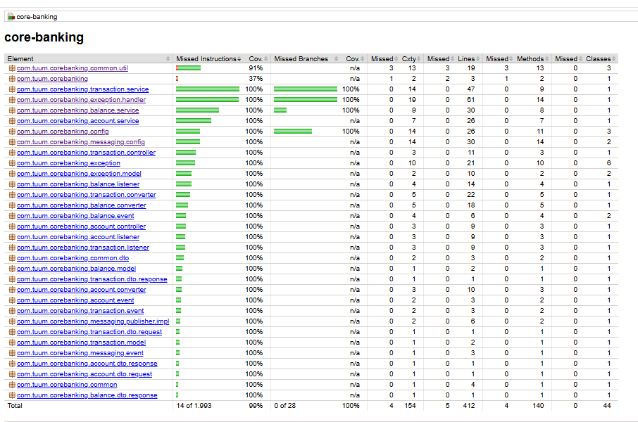
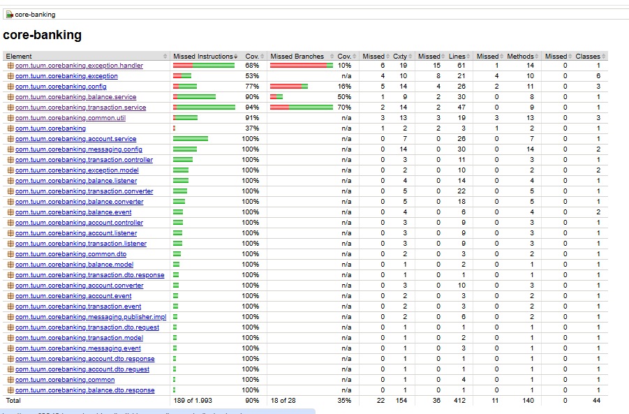
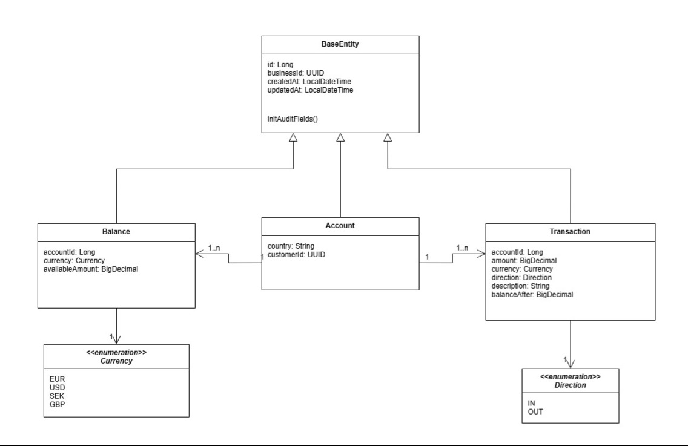
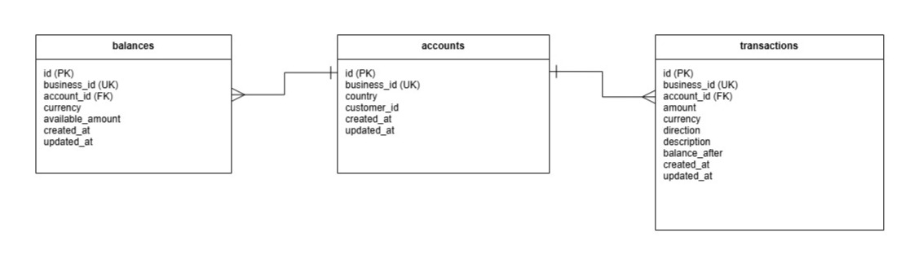
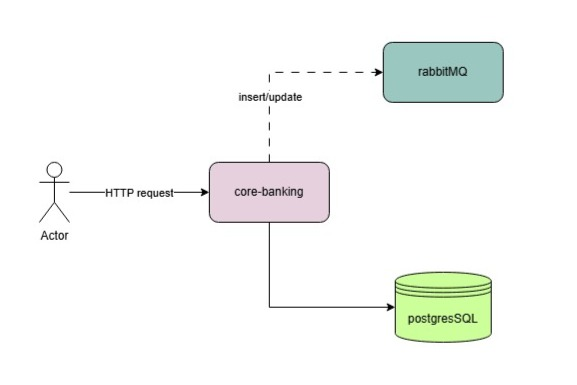

# Core Banking Application - Tuum Software Engineer Test Assignment

A Spring Boot-based core banking solution that manages accounts, balances, and transactions with RabbitMQ event
publishing.

## Technologies

- Java 21
- Spring Boot 4.0.7
- MyBatis 4.0.1
- Gradle
- PostgreSQL 17
- RabbitMQ 4
- JUnit 5
- Testcontainers

## Build and Run

### Prerequisites

- Docker and Docker Compose

### Local Development

1. Download or clone this repository in your machine
2. Open the root folder `/core-banking`
3. And start PostgreSQL, RabbitMQ and the application with Docker Compose running this command:

```bash
docker compose up -d
```

This will:

- Start PostgreSQL on port 5432
- Start RabbitMQ with management UI on ports 5672 and 15672
- Build and start the application on port 8080

RabbitMQ Management UI: `http://localhost:15672`
username: banking_admin
password: password

### Running Tests

Run unit tests:

1. Open a terminal in the root folder `/core-banking`
2. Copy, paste and run the commands bellow for:

**Unit tests:**

```bash
./gradlew test
```

Reports are generated in for unit tests: `build/reports/tests/test/index.html`

- Actual coverage:
  

**Run integration tests (requires Docker):**

```bash
./gradlew integrationTest
```

Reports are generated in `build/reports/jacoco/jacocoIntegrationTestReport/html/index.html`

- Actual coverage:
  

**Generate coverage reports:**

```bash
./gradlew jacocoCombinedReport
```

Reports are generated in `build/reports/jacoco/jacocoCombinedReport/html/index.html`

**Run all tests with coverage verification:**

```bash
./gradlew check
```

Reports are generated in for unit tests: `build/reports/tests/test/index.html`
Reports are generated in for integration tests: `build/reports/tests/integrationTest/index.html`

### Docker Deployment

Build and run everything with Docker Compose:

```bash
docker compose up --build
```

## API Endpoints

The Postman collection is attached in the project root folder - `core-banking.postman-collection.json`

### Create Account

```http
curl --location 'http://localhost:8080/api/accounts' \
--header 'Content-Type: application/json' \
--data '{
    "customerId": "434f010b-74d6-4e78-996a-0189114da84a",
    "country": "EE",
    "currencies": ["EUR", "USD", "SEK"]
}'
```

### Get Account

```http
curl --location 'http://localhost:8080/api/accounts/0ff90499-6576-4573-bf0a-684967ef9436'
```

### Create Transaction

```http
curl --location 'http://localhost:8080/api/accounts/0ff90499-6576-4573-bf0a-684967ef9436/transactions' \
--header 'Content-Type: application/json' \
--data '{
    "amount": 10.67,
    "currency": "USD",
    "direction": "IN",
    "description": "teste IN"
}'
```

### Get Transactions

```http
curl --location 'http://localhost:8080/api/accounts/0ff90499-6576-4573-bf0a-684967ef9436/transactions'
```

## Docker Configuration

### docker-compose.yml

Services:

- **postgres**: PostgreSQL with health checks and volume persistence
- **rabbitmq**: RabbitMQ with management plugin and health checks
- **app**: Spring Boot application, depends on healthy postgres and rabbitmq

### Database Initialization

The application uses Flyway for database schema management. Migration scripts are located in
`src/main/resources/db/migration/`:

- `V1__CREATE_ACCOUNTS_TABLE.sql` - Accounts table with business_id UUID
- `V2__CREATE_BALANCES_TABLE.sql` - Balances with foreign key to accounts
- `V3__CREATE_TRANSACTIONS_TABLE.sql` - Transactions with account_id index

Flyway runs automatically on application startup, so no manual initialization scripts are needed in Docker.

## Architectural and Implementation Choices

### Diagrams:

#### Class diagram



#### Database diagram



#### Architecture diagram



### Domain-Driven Design

The application follows a clear domain separation:

- **Account**: Customer accounts with country and customer ID
- **Balance**: Multi-currency balances per account
- **Transaction**: Financial transactions with balance tracking

### Event-Driven Architecture

Used Spring's `ApplicationEventPublisher` for decoupled event publishing:

- AccountCreatedEvent → RabbitMQ (account.insert routing key)
- BalanceCreatedEvent → RabbitMQ (balance.insert routing key)
- BalanceUpdateEvent → RabbitMQ (balance.update routing key)
- TransactionEvent → RabbitMQ (transaction.insert routing key)

This allows other consumers to react to account changes without tight coupling.

### Database Design

- **Dual ID strategy**: Auto-increment `id` for internal joins, UUID `business_id` for external APIs
- **Precision**: `NUMERIC(20, 8)` for monetary amounts to avoid floating-point errors
- **Indexes**: Index on transactions.account_id for query performance
- **Foreign keys**: Referential integrity between balances/transactions and accounts

### Transaction Management

Used `@Transactional` with pessimistic locking (`FOR UPDATE`) on balance rows during transaction processing to prevent
race conditions and ensure balance consistency under concurrent load.

### MyBatis over JPA

Chose MyBatis for:

- Explicit SQL control for performance-critical operations
- Simpler mapping for this straightforward schema
- Avoiding JPA's overhead for simple CRUD operations

### Error Handling

Custom exceptions for business logic:

- `AccountNotFoundException` - Missing account
- `InsufficientFundsException` - Overdraft prevention
- `InvalidTransactionAmountException` - Negative amounts
- `BusinessException` - Base for domain errors

### Validation

Used Jakarta Validation (`@Valid`) on request DTOs for automatic input validation at the controller level.

### Testing Strategy

- **Unit tests**: Service layer logic with mocked dependencies
- **Integration tests**: Full stack with Testcontainers for PostgreSQL and RabbitMQ
- **Coverage**: JaCoCo verification enforces 80% minimum coverage
- **Separate source sets**: `integrationTest` kept separate from `test` for clear boundaries

## Performance Estimation

Based on JMeter load testing with the provided `jmeter/transaction-load-test.jmx`:

**Test Configuration:**

- Two tests with 150 and 50 concurrent threads
- 15 and 5 -second ramp-up
- 120-second duration
- Single account transaction creation

### Load Test Results — 50 and 150 Threads (Create Transaction)

To validate the estimate above, a load test was run against the `Create Transaction` endpoint with a reduced thread
count, comparing it against a previous run with 150 concurrent threads.

**Overall summary - 50 threads**

- Total requests: 22,886 (higher than the 150-thread run)
- Duration: ~120s
- Errors: 0%

**Latency percentiles (ms)**

| Percentile | 150 threads | 50 threads |
|------------|-------------|------------|
| p50        | 721         | 220        |
| p75        | 996         | 287        |
| p90        | 1,369       | 410        |
| p95        | 1,671       | 511        |
| p99        | 2,523       | 811        |
| Max        | 5,462       | 2,380      |
| Average    | 807.5       | 256.9      |

**Throughput**

|                   | 150 threads | 50 threads |
|-------------------|-------------|------------|
| Overall average   | 175 req/s   | 191 req/s  |
| Per-second median | 178 req/s   | 195 req/s  |
| Per-second max    | 276 req/s   | 293 req/s  |

**Estimated Throughput:**

- After the load tests, it became evident that the application can sustainably handle approximately **150–200
  transactions per second** while maintaining system health, avoiding resource saturation, and keeping latency at
  acceptable levels.

This estimate is based on:

- Local development machine
- App, PostgreSQL and RabbitMQ running in Docker
- No connection pooling optimization beyond defaults
- Single application instance

### Horizontal Scaling Considerations

To scale this application horizontally, consider:

### Database

- Increase the connection pool size.
- Use read replicas for account and transaction queries, allowing the primary database to focus on writes and balance
  updates.
- Partition data (sharding) by customer or account to distribute data across multiple databases, improving scalability
  and reducing the load on a single database instance.
- Ensure PostgreSQL can handle the required number of connections.

### RabbitMQ

- Run RabbitMQ as a clustered setup to ensure high availability and fault tolerance, allowing the system to continue
  processing messages even if one or more nodes fail.
- Tune consumer prefetch to control how many messages each consumer processes at a time, improving throughput and
  preventing a single consumer from being overwhelmed.
- Enable publisher confirms to ensure messages are successfully persisted by RabbitMQ before being acknowledged by the
  producer, reducing the risk of message loss.

### Application

- Keep the application stateless.
- Use a load balancer to distribute traffic.
- Scale instances based on CPU, memory, latency, and error metrics.
- Expose health check endpoints for automatic failover.
- Use asynchronous communication to decouple services, improve resilience, and prevent blocking operations under high
  load.

### Caching

- Use Redis to cache frequently accessed data, reducing database load and improving response times for read-heavy
  operations.
- Invalidate the cache when data changes.

### Monitoring

- Collect metrics with Micrometer and Prometheus.
- Use distributed tracing with OpenTelemetry.
- Centralize logs for easier troubleshooting.

### Deployment

- Use Kubernetes or another container orchestration platform to manage deployment, enable auto-scaling, and improve
  service reliability and scalability.
- Adopt blue-green deployments for zero downtime.
- Use feature flags for safer feature releases.

## AI Usage During Implementation

AI was used as a coding assistant throughout the development process:

### Code Generation

- Initial project structure and boilerplate setup
- MyBatis mapper XML configurations
- RabbitMQ configuration beans
- Exception classes and error handling patterns

### Testing

- Test cases for unit and integration tests
- Testcontainers configuration for PostgreSQL and RabbitMQ
- Mock setups for unit tests

### Documentation

- API endpoint documentation
- JMeter test plan configuration

### Debugging

- Error diagnosis and resolution suggestions
- Performance optimization recommendations
- Best practices for Spring Boot configuration

### Limitations

All AI-generated code was reviewed, tested, and modified to ensure:

- Adherence to requirements
- Consistency with the chosen architecture
- Proper error handling and validation
- Test coverage requirements (80%+)

## License

This project was created as a software engineering test assignment for Tuum.